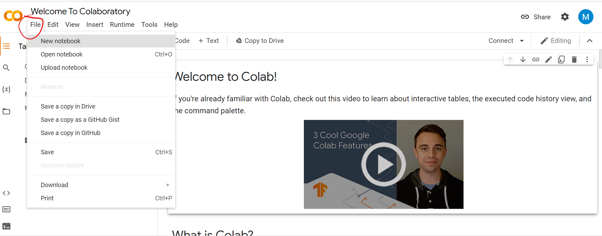
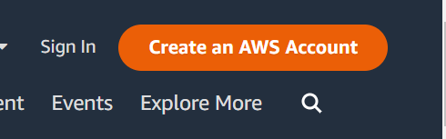
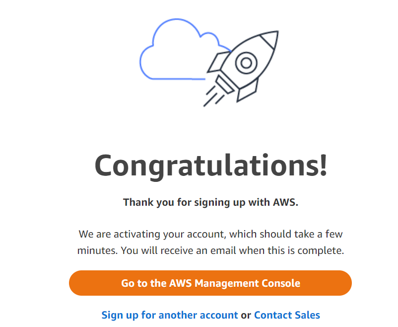
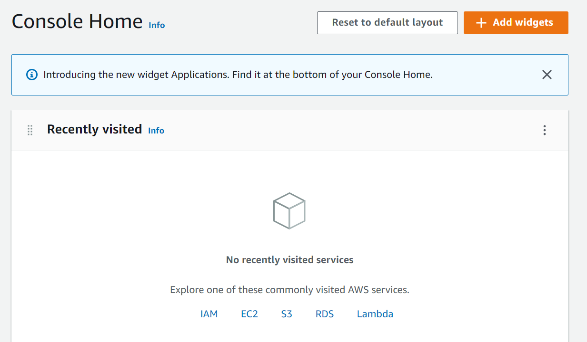
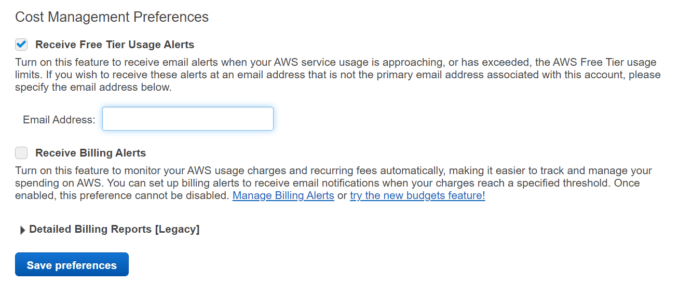
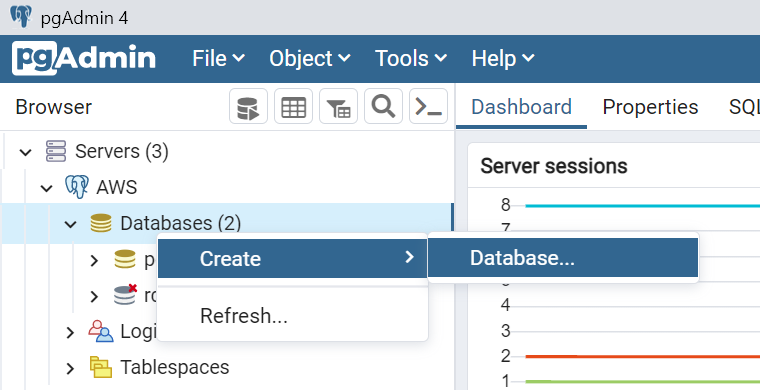
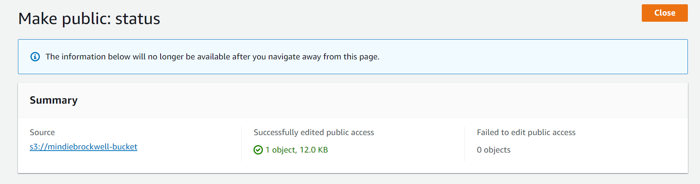
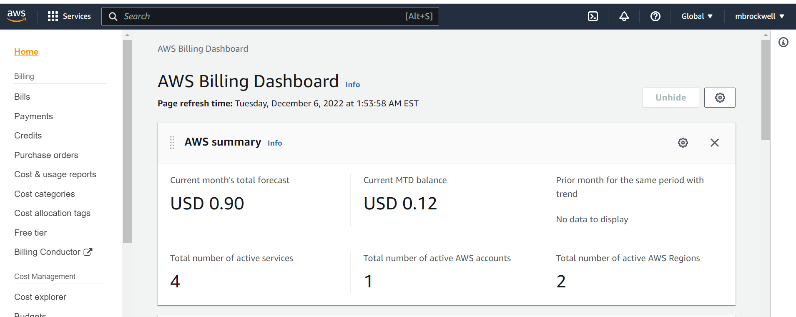

# Module 17 - Big Data

## Module Supplement 

*Note: The module numbering is off in this module. For example you will get to 17.5.3 then you will continue to 17.4.1 at some point later on. Just disregard the fact that they have the numbering wrong, the order itself is correct if you are simply following each page. And my numbering below matches the numbering in the module.*

*Note: Some of the code that they want you to type into Google Colab is simply provided as an image. I try to provide the code itself for you to copy if it seems a bit excessive to have to type out yourself. Just be aware that if you copy from this ReadMe into the code cells, you may have to make sure the spacing/tabs are proper in the code. The copy and paste may take tabs from the ReadMe that doesn't need to be in the code*

## 17.2.2 - mrjob Library

- When creating the file `bacon_counter.py`, I would recommend saving it to a folder that you plan to keep your Module 17 work.

- Resource on Python Classes: https://www.w3schools.com/python/python_classes.asp

- When you download the `input.txt` file, be sure to save it in the same location as your `bacon_counter.py` file.

- The output in the console tells us that the `input.txt` file had the word bacon 21 times.

**Skill Drill**
- Ultimately the bacon_counter file is using the mrjob library to search through the text file and return how many times the word `bacon` was found. In order to test a different word, you would simply replace the word bacon in the code with whatever word you want to find in a file and you can replace the input.txt file with some other text file that you want to search. 

## 17.5.3 - NLP Core Concepts

- When you create a new file to test out the Natural Language Toolkit library, feel free to pick a name for it - I would recommend saving this in the same folder as your `bacon_counter.py` to keep your module work together.

## 17.4.1 - PySpark in Google Colab Notebooks

- Once you are signed into the Google Colab page, if the popup menu that the module shows doesn't come up you can still create a new notebook by going to `File > New Notebook`
    - 

- Instead of using the installation code given in the module, use this:
    ```python
    !apt-get install openjdk-8-jdk-headless -qq > /dev/null
    import os
    os.environ["JAVA_HOME"] = "/usr/lib/jvm/java-8-openjdk-amd64"
    !update-alternatives --set java /usr/lib/jvm/java-8-openjdk-amd64/jre/bin/java

    !pip install pyspark
    ```

## 17.4.2 - Spark DataFrames and Datasets

- Create a new cell when adding new chunks of code to your notebook

- When it says enter and run the following code to create a dataframe, here is code you can copy since the module just has an image:
    ```python
    dataframe = spark.createDataFrame([(0, "Here is our DataFrame"),
                                  (1, "We are making one from scratch"),
                                  (2, "This will look very similar to a Pandas DataFrame")], ["id","words"])

    dataframe.show()
    ```

- When the module gives you an image of code in grey and white rows, the grey is what you are expected to type into a cell in your notebook and the white rows are the expected output.

## 17.4.3 - Spark Functions

- I recommend creating a new notebook for this section. Be sure to include the installation code I provided above in **17.4.1** in the first cell of the notebook.

## 17.7.2 - Create an AWS Relational Database

- The video describes the steps to create an RDS database
    - Navigate to https://aws.amazon.com/
    - Select the `Create an AWS Account` button in the top right corner
        - 
    - Follow the steps to create an account **Note that this will require you to input a credit card to hold for billing. You shouldn't be charged as long as you stay below the AWS Free Tier Limits**
    - When it asks you to select a support plan, be sure to choose **Basic support - Free**
    - Once you have completed sign-up, click on the `Go to the AWS Management Console` button:
        - 
    - You will probably have to sign-in, then should see a screen similar to the image below:
        - 
    - From the Management Console, you can continue following the steps in the video at time (0:37)
    - **When creating the database, make sure to change the Postgres Engine Version to 12.10-R1**
    - The creation of the database itself may take awhile, please wait until the status shows as `Available` before moving on.

## Setting up Free Tier Limit Alerts & Pausing DB Instances

**Free Tier Limit Alerts**
- Click on your username in the top right corner, then click `Account`
- On the left panel, choose `Billing preferences` then check the box for `Receive Free Tier Usage Alerts` and click `Save Preferences`
    - 

**Pausing DB Instances**
- In Section 17.9.2, the module will have you delete any created databases to ensure that you don't exceed any limits. If you are working on the module and don't plan on getting all the way to section 17.9.2 before taking a break for the day (meaning a break more than a few hours - aka overnight) - I recommend you pausing the RDS database instance by following the steps below:
    - Search RDS in the AWS console
    - Go to your DB Instances list
    - Select the radio selector on your `dataviz` database, then under the `Actions` button choose `Stop temporarily`
        - Check the first checkbox to acknowledge that the DB will restart automatically after 7 days, then click the orange `Stop temporarily` button
    - When you are ready to return to using your RDS database instance to continue in the module, simply select your `dataviz` database and in the `Actions` dropdown select `Start`. You will need to wait for the status to be back up and running before you can access it. 

## 17.7.4 - Test with Create, Read, Update, and Delete

*You may want to refresh your usage of PGAdmin from Module 7. This section will review the CRUD methods*

- You need to create a new database called `medical` in your connected RDS instance on PGAdmin
    - 
- As a reminder - Once you create this database, right click on the database name in the left panel and select `Query Tool`. This will open a query editor that you can copy/paste code from the module into to create tables/ect.

## 17.6.1 - Tokenize Data

*You are going back into Google Colab for this section*

- Remember to use the installation I provided from above, I've provided it again below:
    - ```python
        !apt-get install openjdk-8-jdk-headless -qq > /dev/null
        import os
        os.environ["JAVA_HOME"] = "/usr/lib/jvm/java-8-openjdk-amd64"
        !update-alternatives --set java /usr/lib/jvm/java-8-openjdk-amd64/jre/bin/java

        !pip install pyspark

- Then continue with the module code provided:
    - ```python
        # Start Spark session
        from pyspark.sql import SparkSession
        spark = SparkSession.builder.appName("Tokens").getOrCreate()

- To test the tokenizer, here is the code provided in the module image:
    - ```python
        dataframe = spark.createDataFrame([
            (0, "Spark is great"),
            (1, "We are learning Spark"),
            (2, "Spark is better than hadoop no doubt")
        ], ["id", "sentence"])
        dataframe.show()

## 17.6.2 - Stop Words

*Remember to use the installation code from above rather than what is provided in the module in your new notebook*

- Here is the dataframe code from the first image
    - ```python
        sentenceData = spark.createDataFrame([
            (0, ["Big", "data", "is", "super", "powerful"]),
            (1, ["This", "is", "going", "to", "be", "epic"])
        ], ["id", "raw"])
        sentenceData.show(truncate=False)

## 17.6.3 - Term Frequency-Inverse Document Frequency Weight

*Remember to use the installation code from above rather than what is provided in the module in your new notebook*

- Here is the code from the Hashing image:
    - ```python
        #Run the hashing terms frequency
        hashing = HashingTF(inputCol="filtered", outputCol="hashedValues", numFeatures=pow(2,18))

        #Transform into a DF
        hashed_df = hashing.transform(removed_frame)
        hashed_df.show(truncate=False)

- Here is the code from the TF-IDF code image:
    - ```python
        #Fit the IDF on the data set
        idf = IDF(inputCol="hashedValues", outputCol="features")
        idfModel = idf.fit(hashed_df)
        rescaledData = idfModel.transform(hashed_df)

        #Display the DataFrame
        rescaledData.select("words", "features").show(truncate=False)

## 17.6.4 - Pipeline Setup to Run the Model

*Remember to use the installation code from above rather than what is provided in the module in your new notebook*

## 17.8.2 - AWS's Simple Storage Service

*Note: This video is out of date, please follow along to any corrections in the below bullets* 

- When naming your bucket, the bucket has to be a unique name. Use your aws username in the bucket name `<username>-bucket`
- Once your bucket is created, if you don't see a checkbox (my option was a radio select button) - follow these steps to make your bucket public:
    - Click on the name of your bucket in the list 
    - Go to the `Permissions` tab
    - Scroll down and click `Edit` under `Block public access (bucket settings)`
    - Uncheck the `Block *all* public access` checkbox, then hit `Save Changes`
        - It will have you type in *confirm* to confirm the changes
    - You will also need to scroll down and click `Edit` under the `Object Ownership` section. 
        - Select the radio selector for `ACLs enabled` then save your changes
    - Once confirmed, go back to the `Overview` tab on your bucket to continue at around 2:03m of the video
- When uploading a test file, you can use any file from your computer. The video will have you make it public to ensure it works and is accessible publicly so please choose something that doesn't matter if it is public. 
- *Note: When trying to make the uploaded file public, if the `Make Public Using ACL` option is greyed out, be sure to go back a couple bullet points above and enable ACL under the Object Ownership section of your bucket*
- Once you click `Make Public Using ACL` from the Actions dropdown, it will open up another page that you need to click the orange `Make Public` button
    - This will lead to you a status page, where it will tell you if it failed to make the object public. From there click on the URL link under `Source` to go back to your bucket.
        - 
    - Once back at your bucket, you can click on the object you uploaded, and under the `Object Overview` section, on the right hand side you should see a link for `Object URL` if you click that link it should open a tab with the object you uploaded. 

## 17.6.5 - Run the Model

*You are going back to the Google Collab notebook from 17.6.4 where you set up the natural language processing model.*

- When you look at the prediction column, know that your results may look different than the image in the module since your data is randomly split into training/test data.
- Here is the code typed out for the BinaryClassificationEvaluator image:
    - ```python
        from pyspark.ml.evaluation import BinaryClassificationEvaluator

        acc_eval = BinaryClassificationEvaluator(labelCol='label', rawPredictionCol='prediction')
        acc = acc_eval.evaluate(test_results)
        print("Accuracy of model at predicting reviews was: %f" % acc)

## 17.8.3 - PySpark and S3 Stored Data

*For the SkillDrill choose a csv from any previous activity to upload to your bucket. Make sure the file is made public as we did above with our test object. Then you can copy the URL from the uploaded csv object in your bucket and read it into a PySpark Google Collab notebook as you have previously in this module from provided URLs*

Ex) 
```python
    # Read in data from S3 Buckets
    from pyspark import SparkFiles
    url ="https://2u-data-curriculum-team.s3.amazonaws.com/dataviz-online/v2/module_17/yelp_reviews.csv"
    spark.sparkContext.addFile(url)
    df = spark.read.csv(SparkFiles.get("yelp_reviews.csv"), sep=",", header=True)
```

## 17.9.1 - PySpark ETL

- You can upload the two csv's into the bucket that you already created. Be sure to make both csv file objects public as we have above. 

- When you create the new database called `my_data_class_db` in PGAdmin, make sure to right click on the newly created database to open a `Query Tool` for that database.

- When you open a new notebook in Google Collab, be sure to use the installation code provided in previous sections above.

- To get the `<connection string>` for your RDS database, this is the same steps you did before to paste the connection string into PGAdmin. You will need to navigate to RDS (type RDS in your search bar and go to the list of your DB Instances).
    - Click on the name of your DB `dataviz`
    - Copy the text under `Endpoint` - replace `<connection string>` with that text.
    - Replace `<database-name>` with `my_data_class_db`

- When writing to your databases, the code provided in the module that refers to the cleaned dataframes, you will need to add an `ed` to the word `clean` if copying the code from the module.
    - EX) 
    ```python
    # Write DataFrame to active_user table in RDS
    clean_user_df.write.jdbc(url=jdbc_url, table='active_user', mode=mode, properties=config)
    ```
    Should be...
    ```python
    # Write DataFrame to active_user table in RDS
    cleaned_user_df.write.jdbc(url=jdbc_url, table='active_user', mode=mode, properties=config)   
    ```
    - You will need to change `clean` to `cleaned` for the other two dataframes as well if you named them the same as the module images provided 

## 17.9.2 - Shut Down Your Instances

- **This portion is very important to ensure that you don't exceed the Free Tier Limits**

## 17.9.3 - Check AWS Billing

- The Billing & Cost Management Dashboard looks different than what is shown in the module. It also takes a little while for your usage data to show up in the dashboard. If you just started working on this module today, you may need to wait until tomorrow to check this. Once at the Billing dashboard, you can select `Free Tier` from the left side pane and that should show you your current usage next to the description of the limits for the free tier.

- If you find that you've exceeded the free tier limit and it is showing some sort of Current MTD Balance on the `Home` page of the Billing dashboard, you just need to make sure you have deleted any current DB instances as well as buckets then reach out to AWS support. They are good at typically dropping any initial charges when it's your first time using the free tier
    - 

- - -

## Class Material Reviews

### Class 1
- Getting started with Google Colab Notebooks was covered in Lesson **17.4.1**
- The basics of PySpark DataFrames were covered in Lesson **17.4.2**
- Spark functions, transformations, and actions were covered in Lesson **17.4.3**

### Class 2
- Using AWS was covered in Lesson **17.7.1**
- Creating an RDS instance was covered in Lesson **17.7.2**
- Connecting pgAdmin to an RDS instance was covered in Lesson **17.7.3**
- CRUD functions were covered in Lesson **17.7.4**
- AWS S3 was covered in Lesson **17.8.2** and Lesson **17.8.3**
- PySpark ETL with AWS was covered in Lesson **17.9.1**
- AWS Cleanup and managing billing were covered in Lesson **17.9.2** and Lesson **17.9.3**

- - -

## Challenge Instruction Supplement

*Note: I provided an edited starter PySpark notebook. Please use this version rather than what the module provided*

### Deliverable 1

2. When creating the database, follow the steps from Module section 17.7.2
    - Make sure to follow the same steps that you did to ensure the inbound and outbound security group rules are the same as we did in the module. I believe by default it should use the same security group configurations as you had previously, but they may have gone away when you deleted the Module DB instance.
3. Once you create a new database under the connected AWS server for your newly created DB instance, make sure to right click on that database and open a Query Tool for it in order to run the challenge_schema.sql code on your created database.
8. You will need to uncomment the code within the starter notebook that relates to each step and fill in the code needed where it says `<fill in>`, ect to complete each step.
    - When selecting columns for each table df, refer to the tables you made in PGAdmin to select the appropriate columns
    - After creating the `products_table` dataframe, the instructions tell you to create the `review_id_table`. This step is already complete (be sure to use the starter code that I provided not the one in the module). 
    - After writing the dataframes to your database tables (which may take a bit longer than what is suggested in the starter code comments - in some cases double the time), you should be able to see the data in your PGAdmin if you do a `SELECT * FROM <table_name>`

### Deliverable 2

**You have the option to complete this task either using a jupyter notebook with Pandas, a Google Colab PySpark notebook, or using SQL in PGAdmin.**